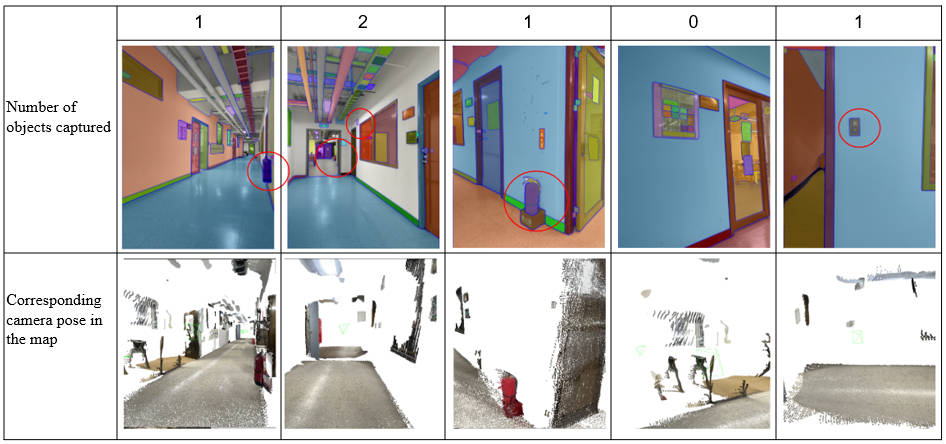

# Overview

## Methodology

### Tools
#### ConceptGraph
[https://github.com/concept-graphs/concept-graphs](https://github.com/concept-graphs/concept-graphs)
#### ChatGPT
[ChatGPT](https://openai.com/index/chatgpt/)
#### PointLLM
[GitHhttps://github.com/OpenRobotLab/PointLLMub](https://github.com/OpenRobotLab/PointLLM)

## Experiments Results
   1. Plan1 image captured results:

    

   2. Plan2 image captured results:

    

   3. Success rate:

    | Experiments | Planning (reachable/total) | Objects | Success Rate |
    |-------------|----------------------------|---------|--------------|
    | Plan1       | 7/9                        | 4       | 3/9          |
    | Plan2       | 5/6                        | 5       | 4/6          |

### 

